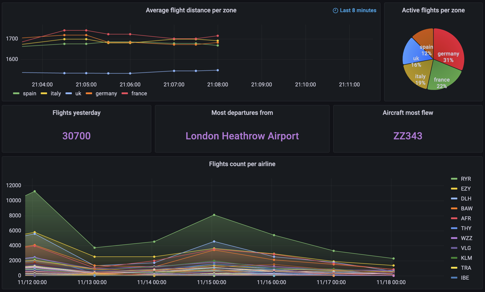

Note: MongoDB's connector for Grafana requires that the final query must have the following form ->  ```{"ts": <>, "name": <>, "value": <>}```.

<details>
<summary> <strong> Flights count per airline </strong> </summary>

This query is constructed in the following way:
- Converts the ts variable from string to date
- Group by day, flight id (to filter unique flights) and airline
- Counts the flights made by each airline on each day

``` sh
db.flights.aggregate([
{"$match": {"origin_airport_iata": {"$ne": "N/A"}, "destination_airport_iata": {"$ne": "N/A"}}},
{"$addFields": {"ts": {"$substr": ["$ts", 0, 10]}}},
{"$addFields": {"ts": {"$dateFromString": {"dateString": "$ts"}}}},
{"$group": {"_id": {"ts": "$ts", "flid": "$id", "line": "$airline_icao"}, "tot": {"$sum": 1}}},
{"$group": {"_id": {"ts": "$_id.ts", "line": "$_id.line"}, "total": {"$sum": "$tot"}}},
{"$project": {"name": "$_id.line", "value": "$total", "ts": "$_id.ts", "_id": 0}},
{"$sort": {"value": -1}},
{"$match": {"name": {"$ne": "N/A"}}}
])
```

</details>


---
<!------------------------------------------------------------------------------------------------------------------>


<details>
<summary> <strong> Flights yesterday </strong> </summary>

This query is constructed in the following way:
- Converts the ts variable from string to date
- Group by day and flight id (to filter unique flights)
- Counts the number of flights made on each day
- Sort descending by date
- Skip those of the current day, limit only the first (previous day)

``` sh
db.flights.aggregate([
{"$match": {"origin_airport_iata": {"$ne": "N/A"}, "destination_airport_iata": {"$ne": "N/A"}}},
{"$addFields": {"ts": {"$substr": ["$ts", 0, 10]}}},
{"$addFields": {"ts": {"$dateFromString": {"dateString": "$ts"}}}},
{"$group": {"_id": {"ts": "$ts", "flid": "$id"}, "tot": {"$sum": 1}}},
{"$group": {"_id": "$_id.ts", "total": {"$sum": "$tot"}}},
{"$project": {"name": "day", "value": "$total", "ts": "$_id", "_id": 0}},
{"$sort": {"ts": -1}},
{"$skip": 1},
{"$limit": 1}
])
```

</details>


---
<!------------------------------------------------------------------------------------------------------------------>


<details>
<summary> <strong> Most departures from </strong> </summary>

This query is constructed in the following way:
- Converts the ts variable from string to date
- Group by flight id (to filter unique flights) and origin airport
- Counts the number of flights made in each airport and take a dummy date
- Filter out missing values (origin airport = NA)
- Sort descending by number of flights
- Limit only the first (most departures)
- Perform a join on the airport collection to retrieve the full name of the airport

``` sh
db.flights.aggregate([
{"$match": {"origin_airport_iata": {"$ne": "N/A"}, "destination_airport_iata": {"$ne": "N/A"}}},
{"$addFields": {"ts": {"$substr": ["$ts", 0, 10]}}},
{"$addFields": {"ts": {"$dateFromString": {"dateString": "$ts"}}}},
{"$group": {"_id": {"id": "$id", "origin": "$origin_airport_iata"}, "tot": {"$sum": 1}, "ts": {"$first": "$ts"}}},
{"$project": {"ts": "$ts", "origin": "$_id.origin", "id": "$_id.id", "tot": 1, "_id": 0}},
{"$match": {"origin": {"$ne": "N/A"}}},
{"$group": {"_id": "$origin", "tot": {"$sum": 1}, "ts": {"$first": "$ts"}}},
{"$sort": {"tot": -1}},
{"$project": {"ts": "$ts", "name": "$_id", "value": "$_id", "_id": 0}},
{"$limit": 1},
{"$lookup": {"from": "airports", "localField": "name", "foreignField": "iata", "as": "fromAir"}},
{"$unwind": {"path": "$fromAir"}},
{"$project": {  "name": "$fromAir.name", "value":  "$fromAir.name", "ts": 1, "_id": 0}}
])
```

</details>


---
<!------------------------------------------------------------------------------------------------------------------>


<details>
<summary> <strong> Aircraft most flew </strong> </summary>

This query is constructed in the following way:
- Converts the ts variable from string to date
- Group by ts, icao code of the aircraft and its number of registration
- Counts the number of flights made by each aircraft
- Filter out missing values (icao = NA | code = NA)
- Sort descending by number of flights
- Limit only the first (most flew)

``` sh
db.flights.aggregate([
{"$match": {"origin_airport_iata": {"$ne": "N/A"}, "destination_airport_iata": {"$ne": "N/A"}}},
{"$addFields": {"ts": {"$substr": ["$ts", 0, 10]}}},
{"$addFields": {"ts": {"$dateFromString": {"dateString": "$ts"}}}},
{"$group": {"_id": {"ts": "$ts", "craft": "$icao_24bit", "code": "$registration"}, "tot": {"$sum": 1}}},
{"$project": {"ts": "$_id.ts", "name": "$_id.craft", "value": "$_id.code",  "_id": 0}},
{"$match": {"craft": {"$ne": "N/A"}, "code": {"$ne": "N/A"}}},
{"$sort": {"value": -1}},
{"$limit": 1}
])
```

</details>


---
<!------------------------------------------------------------------------------------------------------------------>


<details>
<summary> <strong> Average flight distance per zone </strong> </summary>
The following two queries are those in real-time.

Both streams are written in ```append``` mode.

For details about reading the kafka stream and writing the processed stream see ```jupyter/rtprocessing.py```

In Spark:
- After reading the static dataframe about airports, perform a join on the origin airport
- Select and format the variables of interest
- Perform another join on the destination airport
- Select and format the variables of interest
- Calulate the distance (in km) of each flight
- Convert the ts variable from string to date
- Set a watermark of 60 seconds
- Group by a window of 60 seconds, sliding by 30 seconds, and the current location of the flight
- Calculate the average distance per flight per zone in each time window.

``` sh
df.join(airportsDF, df.origin_airport_iata == airportsDF.iata) \
        .select(["ts", "id", col("destination_airport_iata").alias("dest_iata"), "at_zone",
                 col("latitude").alias("craft_lat"), col("longitude").alias("craft_lon"), 
                 col("lat").alias("origin_airport_lat"), col("lon").alias("origin_airport_lon"), 
                 col("iata").alias("origin_airport_iata"), col("name").alias("origin_airport_name")]) \
        .join(airportsDF, col("dest_iata") == airportsDF.iata) \
        .withColumnRenamed("lat", "destination_airport_lat") \
        .withColumnRenamed("lon", "destination_airport_lon") \
        .withColumnRenamed("iata", "destination_airport_iata") \
        .withColumnRenamed("name", "destination_airport_name") \
        .drop(*('_id','country', 'icao', 'dest_iata', 'alt')) \
        .withColumn("port_distance", geodesic_udf(array("origin_airport_lat", "origin_airport_lon"), array("destination_airport_lat", "destination_airport_lon"))) \
        .withColumn("timest",to_timestamp("ts")) \
        .withWatermark("timest", "120 seconds") \
        .groupBy(window("timest", "120 seconds", "60 seconds"), df["at_zone"]) \
        .avg("port_distance") \
        .withColumnRenamed("avg(port_distance)", "avgdistances")
```

In Grafana:
- Format appropriately the query

``` sh
db.distancesRT.aggregate([
{"$project": {"ts": "$window.start", "name": "$at_zone", "value": "$avgdistances", "_id": 0}}
])
```

</details>


---
<!------------------------------------------------------------------------------------------------------------------>


<details>
<summary> <strong> Active flights per zone </strong> </summary>

In Spark:
- Convert the ts variable from string to date
- Set a watermark of 60 seconds
- Group by a window of 60 seconds, sliding by 30 seconds, and the current location of the flight
- Count the number of flights in each time window and each zone.

``` sh
df.withColumn("timest",to_timestamp("ts")) \
                .withWatermark("timest", "120 seconds") \
                .groupBy(window("timest", "120 seconds", "60 seconds"), df["at_zone"]) \
                .count()
```

In Grafana:
- Group by time window and zone
- Sum the total flights in each zone
- Sort descending by time
- Format appropriately the query

``` sh
db.fpzRT.aggregate([
{"$group": {"_id": {"ts": "$window.start", "zone": "$at_zone"}, "tot": {"$sum": "$count"}}},
{"$sort": {"_id.ts": -1}},
{"$project": {"ts": "$_id.ts", "name": "$_id.zone", "value": "$tot", "_id": 0}}
])
```

</details>

---

