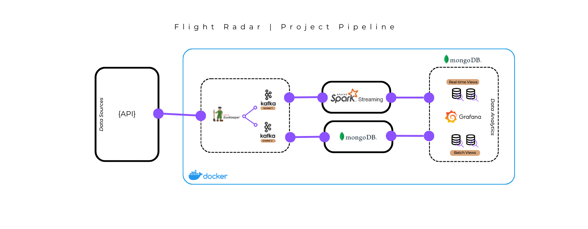

# Flights Monitoring | Lambda-Architecture Implementation (API + KAFKA + SPARK + MONGO + GRAFANA)

<p align="center">
  <a href="">
    
  </a>
  
  <a href="">
    
  </a>
  
  <a href="">
    
  </a>  
</p>

##### Index

* [Introduction](#intro)
* [Quickstart](#usage)
    * Start the containers
    * Check status of MongoDB Sink Kafka Connector
    * Start Grafana-Mongo Proxy
    * Start Spark ReadStream Session
    * Start data ingestion
    * Access dashboard in Grafana
* [Monitoring](#monitoring)
    * Kafka Cluster
    * Kafka-Mongo Connector
    * Spark Jobs
    * MongoDB
* [Components](#components)
* [Troubleshooting](#trouble)

<a name="intro"></a>

## Introduction

The following project was developed with the goal of implementing current leading technologies in both batch and real-time data management and analysis. The data source is FlightRadar24, a website that offers real-time flight tracking services. Through an API it is possible to obtain information, in real time, regarding flights around the globe. The developed dashboard allows the user to obtain general information about past days flights, in addition to real-time analytics regarding live air traffic in each zone of interest.
The real-time characteristic of the chosen data source motivates the need to set up an architecture that can cope with the large number of data arriving in a short period of time. The architecture developed make possible the ability to store data and at the same time analyze it in real time. The pipeline consists of several stages, which use current technologies for Real-Time Data Processing.
All of this was developed in a Docker environment to enable future testing and a total replication of the project.



<a name="usage"></a>

## Quickstart

Prepare yourself three active terminals placed in the project folder.  
In the **first** one:

1. **Start the containers**

``` sh
> docker compose up -d
```

Wait about 30 seconds and run the following command:

2. **Check status of MongoDB Sink Kafka Connector**

``` sh
> curl localhost:8083/connectors/mongodb-connector/status | jq
```

If everything is running go ahead with the steps, otherwise wait about 10 more seconds and retry. If the error persists, see [Troubleshooting](#trouble) section.

3. **Start Grafana-Mongo Proxy**

``` sh
> docker exec -d grafana npm run server
```
  
If you want to see the real-time component of the project in action then execute the next two commands. Otherwise skip directly to the 6° step to view the state of the dashboard at the latest commit.  
  
4. **Start Spark ReadStream Session**

In the **second** terminal:  
``` sh
> docker exec -it jupyter spark-submit --packages org.apache.spark:spark-sql-kafka-0-10_2.12:3.3.1,org.mongodb.spark:mongo-spark-connector:10.0.5 rtprocessing.py
```
  
5. **Start data ingestion**

In the **third** terminal:  
``` sh
> docker exec -it jupyter python producer.py
```
  
6. **Access the dashboard in Grafana** at **localhost:3000** \| admin@password

7. **Stop the streaming**

Whenever you want to stop data generation and processing, simply hit **ctrl+c** in each active terminal.

8. **Shutdown the containers**

To end the session type in the first terminal:
``` sh
> docker-compose down
```

<a name="monitoring"></a>

## Monitoring

1. **KAFKA CLUSTER**

We need first to execute some commands to enable JMX Polling.

``` sh
> docker exec -it zookeeper ./bin/zkCli.sh
$ create /kafka-manager/mutex ""
$ create /kafka-manager/mutex/locks ""
$ create /kafka-manager/mutex/leases ""
$ quit
```

After that we can access the Kafka Manager UI at **localhost:9000**.
Click on **Cluster** and **Add Cluster**.
Fill up the following fields:

* **Cluster Name** = \<insert a name>
* **Cluster Zookeeper Hosts** = zookeeper:2181
  
Tick the following:  

* ✅ **Enable JMX Polling**
* ✅ **Poll consumer information**
  
Leave the remaining fields by default.  
Hit **Save**.  

- - -

2. **KAFKA-MONGO CONNECTOR**

To check the status of the connector and the status of related tasks, execute the following command.

``` sh
> curl localhost:8083/connectors/mongodb-connector/status | jq
```

If everything is working properly you should see a bunch of **Running**.  
Make sure you have installed **jq**, otherwise remove it from the command or install it.

- - -

3. **SPARK JOBS**

To view the activity of spark jobs, access at **localhost:4040/jobs/**.
  
- - -

4. **MONGODB**

You can interact with the db and related collections in Mongo through two options:

``` sh
1. MongoDB Compass UI
2. > docker exec -it mongodb mongo
```

<a name="components"></a>

## Components
**API**

The project is based on data obtained from the [JeanExtreme002/FlightRadarAPI](https://github.com/JeanExtreme002/FlightRadarAPI), an unofficial API for FlightRadar24 written in python.

**CONTAINERS**

| Container     | Image                              | Tag    | Internal Access | Access from host at | Credentials    |
|---------------|------------------------------------|--------|-----------------|---------------------|----------------|
| Zookeeper     | wurstmeister/zookeeper             | latest | zookeeper:2181  |                     |                |
| Kafka1        | wurstmeister/kafka                 |        | kafka1:9092     |                     |                |
| Kafka2        | wurstmeister/kafka                 |        | kafka2:9092     |                     |                |
| Kafka Manager | hlebalbau/kafka-manager            | stable |                 | localhost:9000      |                |
| Kafka Connect | confluentinc/cp-kafka-connect-base |        |                 |                     |                |
| Jupyter       | custom [Dockerfile]                |        |                 | localhost:8889      |                |
| MongoDB       | mongo                              | 3.6    | mongodb:27017   | localhost:27019     |                |
| Grafana       | custom [Dockerfile]                |        |                 | localhost:3000      | admin@password |


**GRAFANA**

To enable MongoDB as a data source for Grafana, it was necessary to create a custom image based on the official one, ```grafana/grafana-oss```, that would integrate the connector. The connector used is the unofficial one from [JamesOsgood/mongodb-grafana](https://github.com/JamesOsgood/mongodb-grafana).

The datasource and the dashboard are [provisioned](https://grafana.com/docs/grafana/latest/administration/provisioning/) as well.

<a name="trouble"></a>

## Troubleshooting
<details>
<summary> <strong> MongoDB Sink Kafka Connector </strong> </summary>

If when _curling_ the state of the connector one of the following error persist:
``` sh
curl: (52) Empty reply from server
```
``` sh
{
  "error_code": 404,
  "message": "No status found for connector mongodb-connector"
}
```

then, in the first case, you can try to:
``` sh
> docker restart kafka_connect
```

Wait about 30 seconds and retry _curling_.

In the second case:
``` sh
> curl -X POST -H "Content-Type: application/json" --data @./connect/properties/mongo_connector_configs.json http://localhost:8083/connectors
```
and retry _curling_.
</details>


<!--
https://github.com/yahoo/CMAK/issues/731
----------------------------------------------------------


----------------------------------------------------------
Miscellaneous:
Chartbrew -> https://github.com/chartbrew/chartbrew
Freeboard -> https://github.com/Freeboard/freeboard
Freeboard plugin -> https://github.com/Hitachi-Data-Systems/Freeboard-plugin-for-MongoDB
Real time dashboard -> https://github.com/sophiamyang/real_time_dashboard/blob/main/realtime_dashboard.py
----------------------------------------------------------


----------------------------------------------------------
Altro:
https://hub.docker.com/r/pataquets/mongodb-proxy/
https://github.com/ajeje93/grafana-mongodb-docker/blob/master/Dockerfile
https://hub.docker.com/r/barisv/grafana-mongo-proxy-server
----------------------------------------------------------
->
